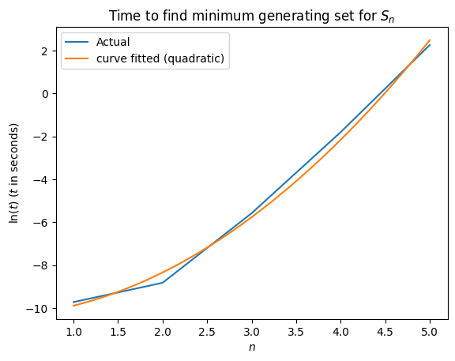
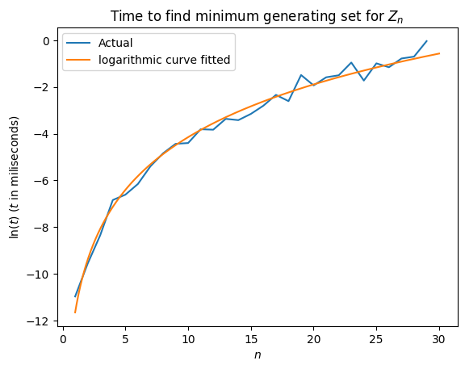
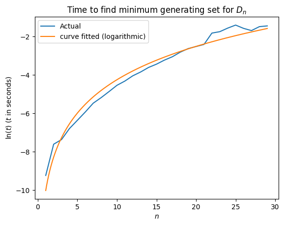

This is a custom made group theory library to implement the first method to find the minumum generating set of a group in polynomial time. 

Upon Running the complexity analysis in the `Groups.ipynb` notebook, these are the results:

